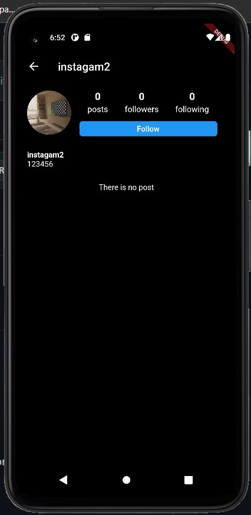
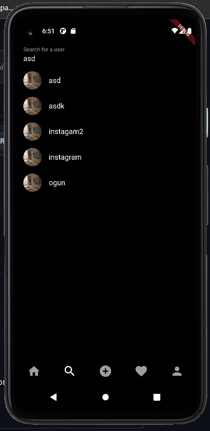

# Instagram Clone

A new Flutter project.

## Getting Started

This project provides some of the Instagram Features that you will see o screenshots at below. Some of the features are not implemented so it can be implemented in the future to engage more people throughout  the project.if you want to contribute, please feel free.

- This is feed scren as you can see .

- This is post screen that will show arbitrary posts.

- This is post sreen which you can upload new post with image and some text

- This is notification screen that I didn't implement but I wanted to put it.

- This is the profile scren that you can check your posts, followers,following.

- you will see this screen when you searched someone in search screen and tapped on it

- This screen will show the users that you have searched by their name

